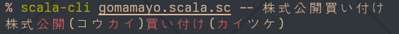
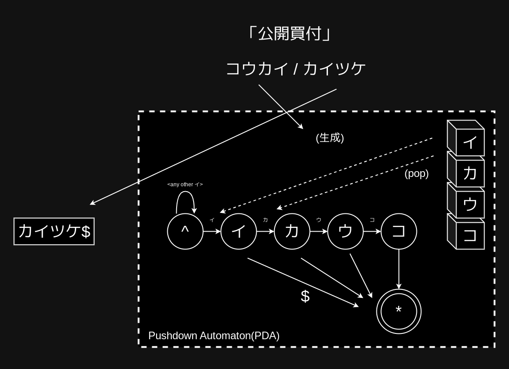

# gomamayo4s

[](./LICENSE)



このツールはゴママヨを検出するためのCLIツールです。アルファ版であり、APIは常に変更されます。

Scala CLIで動作します。

https://scala-cli.virtuslab.org

## Prerequisites

事前にkabosu用の辞書ファイルをダウンロードする必要があります。`fetch-dict.sh`を実行すると辞書がダウンロードされますが、126MiBのファイルがダウンロードされるため通信帯域に注意してください。

```scala
% ./fetch-dict.sh
+ curl -o sudachi.zip -sSL http://sudachi.s3-website-ap-northeast-1.amazonaws.com/sudachidict/sudachi-dictionary-20240109-full.zip
+ unzip sudachi.zip
Archive:  sudachi.zip
  inflating: sudachi-dictionary-20240109/system_full.dic
  inflating: sudachi-dictionary-20240109/LEGAL
  inflating: sudachi-dictionary-20240109/LICENSE-2.0.txt
+ ln -s sudachi-dictionary-20240109/system_full.dic system_core.dic
```

## Usage

`scala-cli ./gomamayo.scala.sc -- 文字列`を実行するとゴママヨ判定が行われます。ゴママヨと判定された箇所はハイライトされます。

```shell
% scala-cli ./gomamayo.scala.sc -- このプログラムを実行する必要要件は辞書ファイルです
このプログラムを実行する必要(ヒツヨウ)要件(ヨウケン)は辞書ファイルです
```

## Inside gomamayo4s



gomamayo4sでは、ゴママヨを検出するためにPDA(Pushdown Automaton)を利用しています。PDAは、ざっくり言うと通常のオートマトンにスタックが付いたもので、しかも同時に複数の場所に遷移できます。

[プッシュダウン・オートマトン - Wikipedia](https://ja.wikipedia.org/wiki/%E3%83%97%E3%83%83%E3%82%B7%E3%83%A5%E3%83%80%E3%82%A6%E3%83%B3%E3%83%BB%E3%82%AA%E3%83%BC%E3%83%88%E3%83%9E%E3%83%88%E3%83%B3)

ゴママヨはなるべく長くマッチさせ続けたいため、gomamayo4sは以下のように振る舞っています(例: 「公開買付」を検出する場合)。

- 2単語(コウカイ / カイツケ)のうち後ろのほうについて以下を行う
  - スタックに単語を積む(単語の末尾がスタックのトップになるようにする)
  - 最初はダミー文字`^`からスタート
  - `カイツケ`を後ろから並べた`ケツイカ`の順で遷移できるようにする
  - 遷移するときスタックをpopしていく
  - 末尾検出文字が渡された場合、`^`以外の状態になっていれば受理する
- 2単語のうち早いほうを逆順に並べ、末尾に`$`(末尾検出用文字)を付けて(`イカウコ$`)順に入力していく
- 受理されればゴママヨ
- スタックはマッチ長検出に使っている(が、実は不要な気がする)
